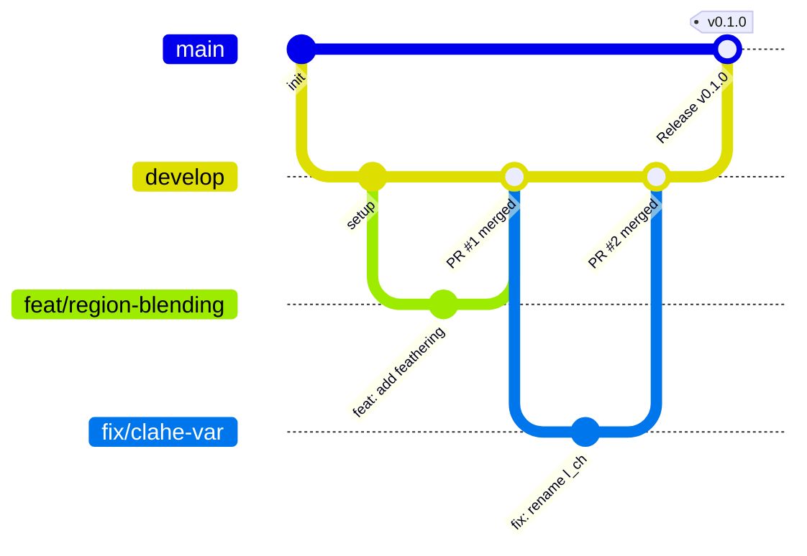

# Contributing Guide (Quy Chuẩn Đóng Góp Dự Án)

Chào mừng bạn đến với dự án **Intelligent Image Processing** (Hệ Thống Xử Lý Ảnh Thông Minh Agentic Khép Kín). Để đảm bảo chất lượng mã nguồn, tính nhất quán khi làm việc nhóm và CI/CD vận hành trơn tru, tất cả thành viên vui lòng tuân thủ quy chuẩn dưới đây.

---

## 1. Branching Strategy (Chiến Lược Phân Nhánh)

Dự án áp dụng mô hình Git Flow rút gọn với các nhánh tiêu chuẩn:



### Các quy tắc đặt tên nhánh:
- `main`: Nhánh production ổn định nhất. Không commit trực tiếp vào `main`.
- `develop`: Nhánh tích hợp chính nơi các tính năng mới được merge sau khi qua review.
- `feat/<feature-name>`: Nhánh phát triển tính năng mới.
  - *Ví dụ:* `feat/vlm-feedback-loop`, `feat/bilateral-filter`, `feat/gradio-ui`
- `fix/<bug-name>`: Nhánh sửa lỗi.
  - *Ví dụ:* `fix/soft-mask-feathering`, `fix/import-sorting`
- `refactor/<module-name>`: Nhánh tái cấu trúc code mà không đổi hành vi.
  - *Ví dụ:* `refactor/processing-engine-base`
- `docs/<topic>`: Nhánh viết/cập nhật tài liệu kỹ thuật.
  - *Ví dụ:* `docs/adr-update`, `docs/api-specs`
- `test/<test-scope>`: Nhánh thêm unit/integration tests.
  - *Ví dụ:* `test/agent-planner`

---

## 2. Commit Message Convention (Quy Chuẩn Commit)

Dự án tuân theo chuẩn [Conventional Commits](https://www.conventionalcommits.org/). Mỗi commit message gồm 3 phần: `<type>(<scope>): <mô tả ngắn>`

### Các loại Type hợp lệ:
| Type | Ý nghĩa | Ví dụ |
|---|---|---|
| `feat` | Thêm tính năng mới | `feat(engine): add non-local means denoise filter` |
| `fix` | Sửa lỗi / bug | `fix(region): fix alpha mask feathering leak at boundary` |
| `docs` | Thêm hoặc cập nhật tài liệu | `docs: add contributing conventions and git workflow` |
| `style` | Định dạng code (whitespace, format, isort) | `style: auto-format imports with ruff` |
| `refactor` | Tái cấu trúc mã nguồn không thay đổi tính năng | `refactor(agent): simplify state transition logic` |
| `perf` | Tối ưu hóa hiệu năng thuật toán | `perf(engine): vectorize CLAHE histogram calculation` |
| `test` | Thêm hoặc sửa unit / integration test | `test(eval): add test cases for BRISQUE metric eval` |
| `chore` | Cập nhật cấu hình, dependencies, tooling | `chore: upgrade ruff and pytest in dev dependencies` |
| `ci` | Chỉnh sửa file workflow GitHub Actions | `ci: optimize ruff action and pytest step in CI` |

### Các Scope phổ biến trong dự án:
- `agent`: LangGraph orchestrator, planner, feedback loop.
- `engine`: Classical CV algorithms (exposure, denoise, sharpen, color).
- `region`: Spatial masks, quadrant, face detection, soft blending.
- `eval`: Reference (PSNR/SSIM) và No-reference (BRISQUE/NIQE) evaluation.
- `api`: FastAPI routes, schemas, lifecycle.
- `ui`: Gradio interface.
- `workflow`: CI/CD pipelines.

---

## 3. Code Standards & Python Guidelines

1. **Python Version**: Tối thiểu Python `>= 3.10`.
2. **Linter & Formatter**: Toàn bộ dự án sử dụng [Ruff](https://github.com/astral-sh/ruff).
   - Chiều dài dòng tối đa: **100 ký tự**.
   - Tự động sắp xếp import (`isort` rules).
   - Không để lại unused imports (`F401`) hoặc biến gây nhầm lẫn (`E741` như biến `l`).
3. **Type Annotations**: Tất cả các hàm và method bắt buộc phải có đầy đủ type hinting:
   ```python
   def apply_gamma(
       image: np.ndarray,
       mask: Optional[np.ndarray] = None,
       gamma: float = 1.0
   ) -> np.ndarray:
       ...
   ```
4. **Kiến trúc Classical CV (ADR-001)**:
   - Các thuật toán biến đổi pixel trong `src/processing_engine/` phải là thuật toán xử lý ảnh kinh điển (OpenCV, scikit-image, NumPy).
   - Tuyệt đối không nhúng các mô hình End-to-End Generative (như Stable Diffusion / GAN) vào processing engine.
5. **Continuous Soft Masks (ADR-003)**:
   - Mọi thao tác xử lý vùng (local region) phải sử dụng soft mask (float32 $\in [0, 1]$) có feathering Gaussian để tránh vệt cắt răng cưa giữa các vùng.

---

## 4. Local Verification Checklist (Trước Khi Push Code)

Trước khi thực hiện `git push`, vui lòng chạy kiểm tra cục bộ theo 3 bước sau:

```bash
# 1. Tự động sửa lỗi format và imports
ruff check src/ tests/ --fix
ruff format src/ tests/

# 2. Đảm bảo linter không còn lỗi nào
ruff check src/ tests/

# 3. Chạy toàn bộ Unit Tests
python -m pytest tests/unit/ -v
```

> [!TIP]
> **Khuyên dùng trên VS Code / PyCharm:**
> - Cài đặt extension **Ruff** (`charliermarsh.ruff`).
> - Bật `"editor.formatOnSave": true` và `"editor.codeActionsOnSave": { "source.fixAll": "explicit" }` trong settings để code tự động chuẩn hóa mỗi khi nhấn Lưu (Ctrl+S).

---

## 5. Pull Request (PR) & Review Process

1. **Tạo PR**: Luôn tạo Pull Request từ nhánh `feat/*` hoặc `fix/*` trỏ về nhánh `develop` (trừ release PR trỏ về `main`).
2. **CI Check**: GitHub Actions sẽ tự động kích hoạt pipeline kiểm tra:
   - Step 1: Kiểm tra chuẩn code với Ruff (`ruff check`).
   - Step 2: Chạy unit tests với PyTest (`pytest tests/unit/`).
   - **PR chỉ được phép merge khi toàn bộ checks đạt màu xanh (PASSED).**
3. **Code Review**: Ít nhất 1 thành viên khác trong nhóm xem xét, để lại comment hoặc approve trước khi merge.
4. **Merge Strategy**: Khuyến khích chọn **Squash and Merge** hoặc **Rebase and Merge** để giữ git log nhánh `develop` sạch sẽ và gọn gàng.
