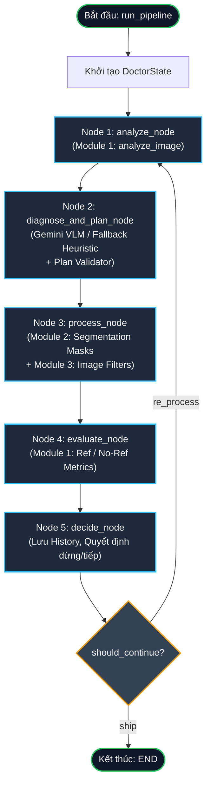

# Tài liệu Thiết kế Kỹ thuật: Máy trạng thái LangGraph (LangGraph State Machine)

> **Mã tài liệu:** `DOC-MOD4-01`  
> **Module:** Module 4 — AI Agent Orchestration & Brain  
> **Người phụ trách:** Person 4 (Backend, VLM & AI Agent)  
> **Source code liên quan:**  
> - [`src/agent/state.py`](file:///C:/Users/Tien/university/imageProcessing/intelligent-image-processing/src/agent/state.py)  
> - [`src/agent/graph.py`](file:///C:/Users/Tien/university/imageProcessing/intelligent-image-processing/src/agent/graph.py)  
> - [`src/agent/planner.py`](file:///C:/Users/Tien/university/imageProcessing/intelligent-image-processing/src/agent/planner.py)  
> - [`src/agent/executor.py`](file:///C:/Users/Tien/university/imageProcessing/intelligent-image-processing/src/agent/executor.py)  
> - [`src/agent/vlm_diagnostician.py`](file:///C:/Users/Tien/university/imageProcessing/intelligent-image-processing/src/agent/vlm_diagnostician.py)  
> **Tài liệu tham chiếu:**  
> - [`docs/interfaces.md`](file:///C:/Users/Tien/university/imageProcessing/intelligent-image-processing/docs/interfaces.md)  
> - [`docs/decisions.md`](file:///C:/Users/Tien/university/imageProcessing/intelligent-image-processing/docs/decisions.md)

---

## 1. Tổng quan Kiến trúc Máy trạng thái (State Machine Overview)

### 1.1 Mục tiêu thiết kế
Trong hệ thống **Intelligent Image Processing**, Module 4 đóng vai trò "Bộ não điều phối" (AI Brain). Để giải quyết bài toán phục hồi và nâng cấp chất lượng ảnh theo phương pháp kinh điển (Classical Image Processing) kết hợp trí tuệ nhân tạo (VLM), hệ thống cần một cơ chế điều khiển khép kín (closed-loop orchestration):
1. **Phân tích (Analyze):** Định lượng các khiếm khuyết vật lý (nhiễu, tương phản, thiếu sáng, mờ).
2. **Chẩn đoán & Lập kế hoạch (Diagnose & Plan):** Mô hình đa phương thức (Gemini VLM) quan sát trực quan bức ảnh kết hợp chỉ số kỹ thuật để chỉ định vị trí vùng và công cụ phù hợp trong Toolbox.
3. **Thực thi (Process):** Tách mặt nạ mềm (Module 2) và áp dụng giải thuật xử lý điểm ảnh (Module 3).
4. **Đánh giá (Evaluate):** Đo lường khách quan mức độ cải thiện (Reference hoặc No-Reference).
5. **Ra quyết định (Decide):** Quyết định bàn giao kết quả (`SHIP`), lặp lại để tối ưu hóa thêm (`RE_PROCESS`), hoặc dừng khẩn cấp/dừng nỗ lực tốt nhất (`STOP_BEST_EFFORT`).

Máy trạng thái được xây dựng dựa trên nền tảng **LangGraph (`StateGraph`)**, cho phép:
- Lưu vết và chuyển đổi trạng thái mang tính biểu diễn (State-driven Execution).
- Ràng buộc giới hạn vòng lặp cứng (`MAX_ITERATIONS = 3`) loại bỏ hoàn toàn nguy cơ lặp vô tận hoặc cạn kiệt API Quota.
- Tương thích tối đa với phần cứng phổ thông / máy dev iGPU (AMD Radeon Graphics, Unified Memory Architecture).

### 1.2 Sơ đồ Luồng Trạng thái Hoạt động (State Graph Flowchart)



---

## 2. Đặc tả Schema Dữ liệu Trạng thái (State Schemas Specification)

Hệ thống phân tách rõ ràng giữa:
- **`DoctorState` (TypedDict):** Ngữ cảnh toàn cục được truyền qua lại giữa các Node trong LangGraph. LangGraph sử dụng cấu trúc Dictionary có định kiểu để hỗ trợ cập nhật cục bộ (partial state updates).
- **Các Pydantic Models (`BaseModel`):** Đảm bảo kiểm tra kiểu dữ liệu nghiêm ngặt (strict validation), serialization/deserialization an toàn khi giao tiếp với VLM hoặc lưu vết JSON.

### 2.1 `RegionOperation` (Pydantic Model)
Đại diện cho một thao tác đơn lẻ trên một vùng ảnh cụ thể được chỉ định trong kế hoạch điều trị.

```python
class RegionOperation(BaseModel):
    region_id: str = Field(..., description="Định danh vùng, ví dụ: 'sky', 'face', 'foreground', 'full_image'")
    target_prompt: str = Field(..., description="Từ khóa nhận diện phục vụ MobileSAM/GroundingDINO")
    detected_issue: str = Field(..., description="Vấn đề kỹ thuật: underexposed, noise, low_contrast, blur, etc.")
    operation: str = Field(..., description="Tên công cụ hợp lệ trong Toolbox")
    parameters: Dict[str, Any] = Field(default_factory=dict, description="Siêu tham số thực thi thuật toán")
    order: int = Field(default=0, description="Độ ưu tiên thực thi trong pipeline")
```

#### Chi tiết từng trường dữ liệu:
| Tên trường | Kiểu dữ liệu | Ràng buộc / Giá trị hợp lệ | Mục đích kỹ thuật |
|---|---|---|---|
| `region_id` | `str` | Chuỗi ký tự không rỗng (e.g., `"sky"`, `"face"`, `"full_image"`) | Định danh ngữ nghĩa của vùng để ghi log và theo dõi trong báo cáo. |
| `target_prompt` | `str` | Text prompt (e.g., `"sky"`, `"face"`, `"full"`, `"person"`) | Chuỗi văn bản truyền trực tiếp cho Module 2 (`segment_by_prompt` hoặc `detect_faces`) để sinh mặt nạ nhị phân/mềm. Nếu là `"full"`, `"all"`, `"full_image"`, bỏ qua Module 2 để áp dụng toàn cục. |
| `detected_issue` | `str` | Chuỗi tự do (e.g., `"underexposed"`, `"high_noise"`, `"color_cast"`) | Ghi nhận chẩn đoán nguyên nhân của VLM, phục vụ giải trình lý do áp dụng bộ lọc. |
| `operation` | `str` | `Literal["denoise", "gamma_correct", "clahe", "sharpen", "color_correct"]` | Tên hàm xử lý trong Module 3. Bắt buộc phải thuộc tập 5 công cụ được phép (`ALLOWED_OPERATIONS`). |
| `parameters` | `Dict[str, Any]` | Dictionary chứa các tham số tương ứng của operation | Chứa siêu tham số đầu vào cho thuật toán lọc ảnh. Được chuẩn hóa và ép dải giá trị bởi `planner.py`. |
| `order` | `int` | Giá trị nguyên $\ge 0$ (mặc định gán qua `priority_map`: 10, 20, 30, 40, 50) | Quyết định thứ tự thực thi thuật toán. Quy tắc bắt buộc: Phải khử nhiễu (`denoise`, order 10) trước khi làm nét (`sharpen`, order 40). |

---

### 2.2 `TreatmentPlan` (Pydantic Model)
Đại diện cho toàn bộ kế hoạch can thiệp kỹ thuật trong một vòng lặp do VLM hoặc Rule-based Heuristic đề xuất.

```python
class TreatmentPlan(BaseModel):
    iteration: int = 1
    reasoning: str = Field(..., description="Lý do chuyên môn từ mô hình VLM")
    actions: List[RegionOperation] = Field(default_factory=list, description="Danh sách các thao tác thực thi")
```

#### Chi tiết từng trường dữ liệu:
| Tên trường | Kiểu dữ liệu | Ràng buộc / Giá trị hợp lệ | Mục đích kỹ thuật |
|---|---|---|---|
| `iteration` | `int` | $\ge 1$ (thường là 1, 2, 3) | Số thứ tự vòng lặp sinh ra kế hoạch này. |
| `reasoning` | `str` | Chuỗi văn bản giải thích chuyên môn | Chứa lời giải thích y khoa/kỹ thuật của VLM (tại sao chọn công cụ này, vùng nào bị lỗi gì). Được hiển thị lên UI để minh bạch hóa hộp đen AI. |
| `actions` | `List[RegionOperation]` | Danh sách từ 0 đến $N$ phần tử | Danh sách các thao tác cần thực hiện tuần tự. Nếu `actions = []`, hệ thống coi như ảnh đã tối ưu hoặc không thể can thiệp thêm. |

---

### 2.3 `HistoryItem` (Pydantic Model)
Bản ghi snapshot trạng thái sau khi hoàn thành một vòng lặp lặp đầy đủ, dùng để so sánh tiến trình cải thiện và truy vết.

```python
class HistoryItem(BaseModel):
    iteration: int
    plan: Optional[TreatmentPlan]
    metrics_before: Dict[str, Any]
    metrics_after: Dict[str, Any]
    eval_score: Dict[str, Any]
    decision: str
```

#### Chi tiết từng trường dữ liệu:
| Tên trường | Kiểu dữ liệu | Ràng buộc / Giá trị hợp lệ | Mục đích kỹ thuật |
|---|---|---|---|
| `iteration` | `int` | $1, 2, 3$ | Đánh dấu chỉ mục vòng lặp của bản ghi. |
| `plan` | `Optional[TreatmentPlan]` | Object hoặc `None` | Bản sao kế hoạch đã được thực thi ở vòng lặp đó. |
| `metrics_before` | `Dict[str, Any]` | Định dạng tương thích `TechnicalMetrics` | Chỉ số kỹ thuật đo lường trước khi can thiệp các bộ lọc (Module 1). |
| `metrics_after` | `Dict[str, Any]` | Định dạng tương thích `TechnicalMetrics` | Chỉ số kỹ thuật đo lường sau khi can thiệp xong các bộ lọc (Module 1). Cho phép tính $\Delta$ cải thiện. |
| `eval_score` | `Dict[str, Any]` | Dict chứa PSNR/SSIM hoặc NIQE/BRISQUE | Kết quả đánh giá chất lượng thị giác độc lập của vòng lặp này. |
| `decision` | `str` | `"SHIP"`, `"RE_PROCESS"`, `"STOP_BEST_EFFORT"` | Quyết định được đưa ra tại cuối vòng lặp tương ứng. |

> [!NOTE]
> **Quy ước thiết kế quan trọng:** `HistoryItem` **không lưu trữ** mảng ảnh `np.ndarray` (cả trước và sau xử lý) để bảo toàn bộ nhớ RAM. Nếu cần hiển thị lịch sử trên UI, đường dẫn file cache trên đĩa (`cache_path`) sẽ được sử dụng thay vì giữ mảng byte thô trong RAM.

---

### 2.4 `DoctorState` (TypedDict)
Cấu trúc trạng thái luân chuyển qua tất cả các cạnh và node trong LangGraph.

```python
class DoctorState(TypedDict):
    original_image: np.ndarray
    current_image: np.ndarray
    ground_truth_image: Optional[np.ndarray]
    is_synthetic: bool
    iteration: int
    max_iterations: int
    technical_metrics: Dict[str, Any]
    treatment_plan: Optional[TreatmentPlan]
    evaluation_result: Dict[str, Any]
    history: List[HistoryItem]
    decision: str
    error_message: Optional[str]
```

#### Bảng đặc tả chi tiết toàn bộ các trường trong `DoctorState`:

| Tên trường | Kiểu dữ liệu | Tính bất biến (Mutability) | Mô tả chi tiết & Vai trò |
|---|---|---|---|
| `original_image` | `np.ndarray` (`uint8`, RGB) | **Immutable** (Bất biến) | Bức ảnh gốc nguyên bản người dùng cung cấp hoặc được sinh từ benchmark. Không bao giờ được phép ghi đè. Đóng vai trò gốc chuẩn để tính no-reference delta hoặc khôi phục khi lỗi. |
| `current_image` | `np.ndarray` (`uint8`, RGB) | **Mutable** (Cập nhật sau mỗi iter) | Trạng thái ảnh hiện tại sau các bước xử lý. Được truyền qua các node để phân tích và áp dụng bộ lọc tiếp theo. |
| `ground_truth_image` | `Optional[np.ndarray]` | **Immutable** (Bất biến) | Ảnh mẫu lý tưởng (sạch nhiễu, đúng sáng). Chỉ tồn tại khi `is_synthetic = True`. Dùng để đo PSNR, SSIM chính xác. Với ảnh đời thực, trường này mang giá trị `None`. |
| `is_synthetic` | `bool` | **Immutable** (Bất biến) | Cờ phân định: `True` (chế độ Benchmark Synthetic, kích hoạt Reference Evaluation); `False` (ảnh thực tế đời thực, kích hoạt No-Reference Evaluation). |
| `iteration` | `int` | **Incremented** (+1 tại decide_node) | Chỉ số vòng lặp hiện tại. Bắt đầu từ 1. Điều khiển logic dừng và kiểm soát số lần gọi API. |
| `max_iterations` | `int` | **Immutable** (Mặc định: 3) | Ngưỡng chặn cứng số vòng lặp tối đa. Ngăn chặn agent bị kẹt trong vòng lặp vô hạn. |
| `technical_metrics` | `Dict[str, Any]` | **Overwritten** sau mỗi iter | Dictionary chứa các chỉ số vật lý ảnh được trích xuất từ Module 1 (`analyze_image`): `brightness_mean`, `contrast_std`, `noise_variance`, `sharpness_laplacian_var`, v.v. |
| `treatment_plan` | `Optional[TreatmentPlan]` | **Overwritten** sau mỗi iter | Kế hoạch điều trị của vòng lặp hiện hành, đã được validate và sắp xếp bởi `planner.py`. |
| `evaluation_result` | `Dict[str, Any]` | **Overwritten** sau mỗi iter | Kết quả đo đạc chất lượng từ Module 1 (`evaluate_reference` hoặc `evaluate_no_reference`). |
| `history` | `List[HistoryItem]` | **Append-only** | Danh sách tích lũy các bản ghi lịch sử của từng vòng lặp đã đi qua. |
| `decision` | `str` | **Updated** tại decide_node | Trạng thái phán quyết hiện tại: `"INITIALIZING"`, `"RE_PROCESS"`, `"SHIP"`, `"STOP_BEST_EFFORT"`. |
| `error_message` | `Optional[str]` | **Nullable / Tracked** | Ghi nhận thông điệp ngoại lệ nếu có bất kỳ node nào gặp lỗi nội bộ. Cho phép pipeline tự phục hồi an toàn. |

---

## 3. Đặc tả Chi tiết 5 Node trong LangGraph (Node Specifications)

Mỗi Node trong LangGraph là một hàm Python nhận vào `state: DoctorState` và trả về một `Dict[str, Any]` chứa các trường trạng thái cần cập nhật (partial state update).

```
   ┌─────────────────────────────────────────────────────────────┐
   │                       DoctorState                           │
   └───────────────┬─────────────────────────────▲───────────────┘
                   │ Đọc fields cần thiết        │ Cập nhật delta
                   ▼                             │
            ┌──────────────┐              ┌──────────────┐
            │   Input      │ ──► Logic ──►│   Output     │
            │  Sub-state   │    Nội bộ    │ State-delta  │
            └──────────────┘              └──────────────┘
```

---

### 3.1 Node 1: `analyze_node`

#### Mục đích:
Thực hiện trích xuất toàn bộ các đặc trưng thống kê và chỉ số đo lường vật lý từ bức ảnh `current_image` thông qua Module 1 (`src.analyzer_evaluator.analyzer.analyze_image`).

#### Đặc tả Interface:
- **Hàm:** `analyze_node(state: DoctorState) -> Dict[str, Any]`
- **Input Keys:**
  - `state["current_image"]`: `np.ndarray` (RGB, `uint8`, shape `(H, W, 3)`).
- **Output Keys:**
  - `technical_metrics`: `Dict[str, Any]` (chuyển đổi từ `TechnicalMetrics.model_dump()`).

#### Xử lý logic nội bộ:
1. Kiểm tra tính hợp lệ của `current_image` (không `None`, kích thước hợp lệ, 3 kênh màu).
2. Gọi hàm Module 1:
   ```python
   metrics = analyze_image(state["current_image"])
   ```
3. Chuyển đổi Pydantic model `TechnicalMetrics` thành dict chuẩn để lưu trong State:
   ```python
   return {"technical_metrics": metrics.model_dump()}
   ```

#### Chỉ số kỹ thuật chính được tính toán:
- `brightness_mean`: Độ sáng trung bình $[0, 255]$.
- `brightness_level`: `"underexposed"`, `"normal"`, hoặc `"overexposed"`.
- `contrast_std`: Độ lệch chuẩn độ sáng (đại diện tương phản).
- `contrast_level`: `"low"`, `"normal"`, `"high"`.
- `noise_variance`: Phương sai nhiễu ước lượng qua bộ lọc Laplacian bậc 2.
- `noise_level`: `"clean"`, `"low"`, `"medium"`, `"severe"`.
- `sharpness_laplacian_var`: Phương sai toán tử Laplace (độ sắc nét cạnh).
- `blur_level`: `"sharp"`, `"mild_blur"`, `"severe_blur"`.
- `color_cast`: Thiên hướng lệch màu (`"warm"`, `"cool"`, `"greenish"`, `"none"`).

---

### 3.2 Node 2: `diagnose_and_plan_node`

#### Mục đích:
Đóng vai trò "Hội chẩn y khoa": Tiếp nhận trực quan bức ảnh và các chỉ số đo lường từ Node 1, kích hoạt VLM (Gemini 1.5 Flash) để chẩn đoán vùng bệnh, đề xuất các thao tác sửa chữa; sau đó đưa kế hoạch qua bộ lọc thẩm định an toàn (`validate_and_sort_plan`).

#### Đặc tả Interface:
- **Hàm:** `diagnose_and_plan_node(state: DoctorState) -> Dict[str, Any]`
- **Input Keys:**
  - `state["current_image"]`: `np.ndarray` (ảnh RGB hiện tại).
  - `state["technical_metrics"]`: `Dict[str, Any]` (chỉ số đo từ Node 1).
  - `state["iteration"]`: `int` (vòng lặp hiện tại).
- **Output Keys:**
  - `treatment_plan`: `TreatmentPlan` (kế hoạch điều trị đã được thẩm định an toàn).

#### Xử lý logic nội bộ:
1. **Gọi chẩn đoán VLM:**
   - Đóng gói System Prompt + JSON Metrics + PIL Image gửi tới Gemini API.
   - Nếu không có API Key hoặc gặp sự cố mạng, chuyển đổi sang bộ quy tắc tĩnh **Rule-based Heuristic Fallback** (dựa vào các ngưỡng `brightness_level`, `noise_level`, `contrast_level`).
   - Bóc tách kết quả JSON từ chuỗi phản hồi của VLM và parse vào `TreatmentPlan`.
2. **Thẩm định và Sắp xếp kế hoạch (`validate_and_sort_plan`):**
   - Loại bỏ toàn bộ các hành động không thuộc 5 thao tác cho phép (`ALLOWED_OPERATIONS`).
   - Kẹp (clamp) các tham số thuật toán về khoảng an toàn (ví dụ: $0.1 \le \text{strength} \le 2.0$, $0.5 \le \gamma \le 2.5$).
   - Sắp xếp thứ tự ưu tiên xử lý chuẩn:
     $$\text{Denoise (10)} \longrightarrow \text{Gamma (20)} \longrightarrow \text{CLAHE (30)} \longrightarrow \text{Sharpen (40)} \longrightarrow \text{Color Correct (50)}$$
3. Trả về kế hoạch điều trị hoàn chỉnh:
   ```python
   return {"treatment_plan": validated_plan}
   ```

---

### 3.3 Node 3: `process_node`

#### Mục đích:
Thực thi kế hoạch điều trị trên ảnh hiện tại. Kết nối trực tiếp Module 2 (Region Engine) để tạo mặt nạ vùng và Module 3 (Image Processing Engine) để áp dụng các bộ lọc điểm ảnh.

#### Đặc tả Interface:
- **Hàm:** `process_node(state: DoctorState) -> Dict[str, Any]`
- **Input Keys:**
  - `state["current_image"]`: `np.ndarray` (ảnh trước khi xử lý).
  - `state["treatment_plan"]`: `Optional[TreatmentPlan]` (danh sách thao tác cần làm).
- **Output Keys:**
  - `current_image`: `np.ndarray` (ảnh mới sau khi đã áp dụng toàn bộ các thao tác).

#### Xử lý logic nội bộ:
1. Kiểm tra kế hoạch điều trị: Nếu `treatment_plan` là `None` hoặc `treatment_plan.actions` rỗng, giữ nguyên ảnh:
   ```python
   if not state.get("treatment_plan") or not state["treatment_plan"].actions:
       return {"current_image": state["current_image"]}
   ```
2. Gọi `execute_plan(state["current_image"], state["treatment_plan"])`:
   - Khởi tạo bản sao ảnh làm việc: `current_img = image.copy()`.
   - Lặp tuần tự qua từng `action` trong danh sách đã sắp xếp:
     a. **Tạo Mask (Module 2):**
        - Nếu `target_prompt` là `"face"` hoặc `"khuôn mặt"`: gọi `detect_faces(current_img)`.
        - Nếu `target_prompt` là đối tượng cụ thể (e.g., `"sky"`, `"car"`): gọi `segment_by_prompt(current_img, target_prompt)` sinh soft-mask (`float32 [0.0, 1.0]`).
        - Nếu `target_prompt` là `"full"`, `"all"`, `"full_image"`: `mask = None` (xử lý toàn ảnh).
     b. **Thực thi bộ lọc (Module 3):**
        - Điều phối gọi các hàm chuyên biệt tương ứng: `apply_denoise`, `apply_gamma`, `apply_clahe`, `apply_sharpen`, hoặc `apply_color_balance`.
        - Trộn mặt nạ alpha blending mượt mà:
          $$I_{\text{out}} = M \odot I_{\text{processed}} + (1.0 - M) \odot I_{\text{current}}$$
3. Trả về ảnh kết quả sau khi hoàn tất chuỗi thao tác:
   ```python
   return {"current_image": processed_img}
   ```

---

### 3.4 Node 4: `evaluate_node`

#### Mục đích:
Đánh giá khách quan chất lượng của bức ảnh vừa được xử lý. Tuân thủ quyết định kiến trúc **ADR-002: Dual-Path Evaluation Split**, tự động rẽ nhánh dựa vào nguồn gốc dữ liệu ảnh.

#### Đặc tả Interface:
- **Hàm:** `evaluate_node(state: DoctorState) -> Dict[str, Any]`
- **Input Keys:**
  - `state["current_image"]`: `np.ndarray` (ảnh sau xử lý ở vòng lặp này).
  - `state["original_image"]`: `np.ndarray` (ảnh gốc ban đầu).
  - `state["ground_truth_image"]`: `Optional[np.ndarray]` (ảnh mẫu lý tưởng nếu có).
  - `state["is_synthetic"]`: `bool` (cờ phân định nguồn dữ liệu).
- **Output Keys:**
  - `evaluation_result`: `Dict[str, Any]` (chứa các điểm đo chất lượng).

#### Xử lý logic nội bộ:
```python
is_syn = state.get("is_synthetic", False)
gt = state.get("ground_truth_image")

if is_syn and gt is not None:
    # Nhánh 1: Synthetic Benchmark (Có Ground-Truth)
    eval_metrics = evaluate_reference(state["current_image"], gt)
else:
    # Nhánh 2: Real-World Photo (Không có Ground-Truth)
    eval_metrics = evaluate_no_reference(
        current_image=state["current_image"], 
        previous_image=state["original_image"]
    )

return {"evaluation_result": eval_metrics}
```

#### Ý nghĩa các nhánh đánh giá:
- **Nhánh Reference:** Tính toán chỉ số toán học tuyệt đối so với Ground Truth: $\text{PSNR}$ (dB), $\text{SSIM}$ $[0, 1]$, và $\text{MSE}$.
- **Nhánh No-Reference:** Tính toán các chỉ số chất lượng cảm nhận không tham chiếu: $\text{NIQE}$ (càng thấp càng tự nhiên), $\text{BRISQUE}$ $[0, 100]$, kết hợp độ lệch cải thiện của các chỉ số kỹ thuật ($\Delta \text{contrast}$, $\Delta \text{noise}$).

---

### 3.5 Node 5: `decide_node`

#### Mục đích:
Là "Hội đồng nghiệm thu": Tổng hợp kết quả từ các bước trước, ghi nhận một snapshot vào `history`, kiểm tra các tiêu chuẩn nghiệm thu và quyết định xem có tiếp tục vòng lặp tiếp theo hay kết thúc pipeline.

#### Đặc tả Interface:
- **Hàm:** `decide_node(state: DoctorState) -> Dict[str, Any]`
- **Input Keys:**
  - `state["iteration"]`, `state["max_iterations"]`
  - `state["treatment_plan"]`
  - `state["technical_metrics"]`
  - `state["current_image"]`
  - `state["evaluation_result"]`
  - `state["history"]`
- **Output Keys:**
  - `iteration`: `state["iteration"] + 1`
  - `decision`: `"SHIP"`, `"RE_PROCESS"`, hoặc `"STOP_BEST_EFFORT"`
  - `history`: `List[HistoryItem]` (danh sách đã append bản ghi mới).

#### Xử lý logic nội bộ:
1. **Khởi tạo bản ghi lịch sử (`HistoryItem`):**
   - Đo lại các chỉ số kỹ thuật của bức ảnh mới qua `analyze_image(state["current_image"])`.
   - Đóng gói: `iteration`, `plan`, `metrics_before`, `metrics_after`, `eval_score`.
2. **Kiểm tra tiêu chí dừng theo thứ tự ưu tiên:**
   - **Ưu tiên 1 (Chặn cứng số vòng):** Nếu `iteration >= max_iterations` (mặc định 3):
     $$\text{decision} \longleftarrow \text{"STOP\_BEST\_EFFORT"}$$
   - **Ưu tiên 2 (Không còn việc để làm):** Nếu `treatment_plan` rỗng hoặc không có actions:
     $$\text{decision} \longleftarrow \text{"SHIP"}$$
   - **Ưu tiên 3 (Kiểm tra chất lượng đạt chuẩn):**
     - Với ảnh Synthetic: Nếu $\text{PSNR} \ge 28.0\text{ dB}$ và $\text{SSIM} \ge 0.88 \longrightarrow \text{"SHIP"}$.
     - Nếu phát hiện suy thoái chất lượng nghiêm trọng ($\text{PSNR}$ sụt quá $1.5\text{ dB}$) $\longrightarrow \text{"STOP\_BEST\_EFFORT"}$.
     - Với ảnh Thực tế: Nếu các chỉ số kỹ thuật đã đạt chuẩn (`noise_level == "clean"`, `brightness_level == "normal"`) $\longrightarrow \text{"SHIP"}$.
   - **Ưu tiên 4 (Tiếp tục tối ưu):** Nếu chưa đạt và chưa chạm ngưỡng vòng lặp:
     $$\text{decision} \longleftarrow \text{"RE\_PROCESS"}$$
3. Cập nhật quyết định vào bản ghi lịch sử, tăng `iteration + 1` và trả về delta state.

---

## 4. Phân tích Hàm điều hướng và Cơ chế Rẽ nhánh (Conditional Edges & Routing)

### 4.1 Hàm điều hướng `should_continue(state)`

Hàm `should_continue` là một **Conditional Edge Function** được đăng ký trên `StateGraph`. Hàm này nhận trạng thái hiện thời của State sau khi `decide_node` chạy xong và ánh xạ sang tên nhãn nhánh tiếp theo.

```python
def should_continue(state: DoctorState) -> str:
    """Hàm điều hướng có rẽ nhánh tiếp tục lặp hay kết thúc."""
    if state["decision"] == "RE_PROCESS":
        return "re_process"
    return "ship"
```

Trong hàm `build_doctor_graph()`, cạnh điều kiện được thiết lập như sau:
```python
workflow.add_conditional_edges(
    "decide",
    should_continue,
    {
        "re_process": "analyze",
        "ship": END
    }
)
```

### 4.2 Bảng Chuyển trạng thái (State Transition Table)

| Giá trị `decision` tại `decide_node` | Giá trị trả về của `should_continue` | Node đích tiếp theo | Ý nghĩa vận hành |
|---|---|---|---|
| `"RE_PROCESS"` | `"re_process"` | `analyze_node` | Bức ảnh cần tiếp tục được tinh chỉnh; quay lại chu trình từ đầu với ảnh `current_image` mới. |
| `"SHIP"` | `"ship"` | `END` | Bức ảnh đã đạt chất lượng kỳ vọng hoặc VLM không còn khuyến nghị can thiệp; xuất ảnh cuối cùng. |
| `"STOP_BEST_EFFORT"` | `"ship"` | `END` | Đã chạm ngưỡng số lần lặp tối đa hoặc phát hiện suy giảm chất lượng nếu tiếp tục sửa; dừng lại ở trạng thái tốt nhất có thể. |
| Bất kỳ giá trị lỗi nào khác | `"ship"` | `END` | Fail-safe: Tự động kết thúc pipeline an toàn, ngăn chặn kẹt vòng lặp. |

### 4.3 Cơ chế Chặn cứng `MAX_ITERATIONS = 3` (Hard Stop Guarantee)
Việc giới hạn số vòng lặp tối đa mang tính sống còn đối với hệ thống AI Agent vì các lý do sau:
1. **Ngăn chặn chi phí và cạn kiệt API Quota:** VLM (Gemini) tính phí theo số lượng token và số lượt gọi. Nếu agent rơi vào tình trạng dao động (oscillation) giữa làm nét và khử nhiễu, vòng lặp vô tận sẽ làm cạn kiệt quota ngay lập tức.
2. **Tránh biến dạng điểm ảnh tích lũy (Artifact Accumulation):** Mỗi lần áp dụng các bộ lọc kinh điển (đặc biệt là Unsharp Masking hoặc CLAHE), ảnh sẽ tích lũy một lượng sai số làm tròn số học (rounding error trên `uint8`) và quầng sáng giả (haloing artifacts). Sau 3 vòng lặp, việc can thiệp thêm thường làm giảm chất lượng thị giác thay vì cải thiện.
3. **Đảm bảo tính quyết định thời gian thực (Deterministic Latency):** Giới hạn tối đa 3 vòng lặp giúp dự báo được thời gian xử lý tối đa (Worst-Case Execution Time - WCET) cho một bức ảnh trên môi trường iGPU/CPU, phục vụ triển khai backend và giao diện web mượt mà.

---

## 5. Chiến lược Quản lý Bộ nhớ RAM trên Máy Dev iGPU (Memory Management Strategy)

### 5.1 Phân tích Rủi ro Bộ nhớ trên Kiến trúc AMD Radeon iGPU (UMA)
Trên các máy tính phát triển sử dụng iGPU (ví dụ: AMD Radeon 680M/780M hoặc Intel Iris Xe):
- Không có bộ nhớ VRAM chuyên dụng độc lập; **VRAM và RAM hệ thống dùng chung một không gian vật lý (Unified Memory Architecture - UMA)**.
- Khi các mô hình thị giác máy tính (MobileSAM, GroundingDINO) nạp trọng số vào bộ nhớ kết hợp với nhiều bản sao mảng NumPy của ảnh độ phân giải cao ($1080\text{p}$, $4\text{K}$), nguy cơ tràn RAM hệ thống (Out of Memory - OOM) hoặc kích hoạt Windows Paging File (khiến hệ thống bị đóng băng nhiều giây) là rất lớn.

#### Phân tích footprint bộ nhớ của ảnh NumPy:
- Một ảnh RGB kích thước Full HD ($1920 \times 1080$):
  $$\text{RAM}_{\text{uint8}} = 1920 \times 1080 \times 3 \times 1\text{ byte} \approx 6.22\text{ MB}$$
- Một mặt nạ mềm float32 ($1920 \times 1080$):
  $$\text{RAM}_{\text{float32}} = 1920 \times 1080 \times 4\text{ bytes} \approx 8.29\text{ MB}$$
- Nếu lưu trữ toàn bộ ảnh gốc, ảnh trung gian qua 3 vòng lặp, ảnh Ground Truth, cộng với các tensor PyTorch trung gian và danh sách history chứa mảng NumPy, tổng dung lượng RAM cấp phát cho các mảng liên tục có thể vượt quá $500\text{ MB} - 1.5\text{ GB}$ trên một tiến trình.

### 5.2 Các Nguyên tắc Quản lý RAM Bắt buộc

#### 1. Nguyên tắc "Metadata-Only History" (Không lưu ảnh trong History):
- Model `HistoryItem` tuyệt đối **không chứa** mảng `np.ndarray`.
- Chỉ lưu trữ các giá trị số và chuỗi: metrics trước, metrics sau, eval score, plan.
- Nếu giao diện người dùng yêu cầu hiển thị slider so sánh qua từng vòng lặp:
  - Lưu ảnh ra thư mục đĩa tạm: `cache/runs/{session_id}/iter_{i}.webp` (nén WebP chất lượng cao 90%).
  - State chỉ giữ chuỗi `image_path` hoặc URL dẫn tới file cache đó.

#### 2. Vòng đời Mặt nạ Ngắn hạn (Short-lived Mask Scope):
- Mặt nạ phân đoạn `mask` từ Module 2 (MobileSAM/MediaPipe) **chỉ được sinh ra và tồn tại cục bộ bên trong phạm vi hàm `execute_plan`**.
- Không bao giờ gán `mask` vào `DoctorState`.
- Sau khi thực hiện phép alpha blending:
  $$I_{\text{blended}} = (M \cdot I_{\text{proc}} + (1.0 - M) \cdot I_{\text{in}}).\text{astype}(\text{np.uint8})$$
  Lập tức giải phóng biến tham chiếu `mask` và gọi thu hồi nếu cần.

#### 3. Tối ưu hóa Kiểu dữ liệu (Dtype Discipline):
- Tất cả các mảng ảnh lưu giữ lâu dài trong `DoctorState` (`original_image`, `current_image`, `ground_truth_image`) bắt buộc phải ở định dạng **`np.uint8`** ($[0, 255]$).
- Các phép tính toán trong Module 3 (như Gamma, Unsharp Mask) chuyển tạm thời sang `float32` để tính toán số học, nhưng phải được `np.clip(..., 0, 255).astype(np.uint8)` ngay trước khi return.

#### 4. Thu gom Rác chủ động (Explicit Garbage Collection):
Tại điểm cuối của `decide_node` khi chuẩn bị quay lại vòng lặp mới, hệ thống thực hiện giải phóng tài nguyên:
```python
import gc
# Giải phóng các vùng đệm bộ nhớ không sử dụng giữa các iteration
gc.collect()
```
Đối với PyTorch / ONNX Runtime phục vụ Module 2, đặt cờ giải phóng bộ nhớ đệm CPU/DirectML sau mỗi lần inference phân đoạn.

---

## 6. Xử lý Ngoại lệ ở Cấp độ Node (Node-Level Exception Handling & Fault Tolerance)

Để đảm bảo hệ thống vận hành bền bỉ (resilient), **không một ngoại lệ nào từ các module con được phép làm sập tiến trình chạy của LangGraph State Machine**. Mọi sự cố đều phải được bắt giữ (catch), ghi nhận vào `error_message`, và chuyển đổi sang trạng thái xử lý an toàn (Graceful Degradation).

### 6.1 Sơ đồ Phục hồi Lỗi từng Node

| Node | Các nguy cơ ngoại lệ tiềm ẩn | Chiến lược bắt lỗi & Tự phục hồi |
|---|---|---|
| **Node 1: `analyze_node`** | - Ảnh bị rỗng (`None`) hoặc kích thước 0.<br>- Ảnh sai định dạng màu.<br>- Lỗi tràn số khi tính phương sai Laplace. | Bọc toàn bộ trong khối `try...except Exception`. Nếu lỗi, gán `technical_metrics` về giá trị mặc định chuẩn (an toàn) và gán `state["error_message"] = "Analyzer failure: ..."`. Pipeline vẫn tiếp tục chạy. |
| **Node 2: `diagnose_and_plan_node`** | - Không có internet / Gemini API timeout.<br>- Hết Quota (HTTP 429 Too Many Requests).<br>- VLM sinh ra JSON hỏng không parse được. | Bắt `Exception` trong `vlm_diagnostician.py`. Tự động fallback sang **Rule-based Heuristic Planner** (sinh kế hoạch dựa trên ngưỡng thống kê kỹ thuật từ Node 1). Nếu cả fallback thất bại, trả về `TreatmentPlan(actions=[])` để `decide_node` cho kết thúc an toàn. |
| **Node 3: `process_node`** | - GroundingDINO không tìm thấy đối tượng trong prompt.<br>- MediaPipe không phát hiện được khuôn mặt.<br>- Tham số bộ lọc Module 3 không hợp lệ (ví dụ: `clip_limit` âm, kernel kích thước chẵn). | Áp dụng cơ chế **Atomic Operation Fallback**: Duyệt từng `action`. Nếu một action cụ thể bị ném ngoại lệ (OpenCV error), bỏ qua action đó, ghi cảnh báo vào log, giữ nguyên trạng thái ảnh trước thao tác đó và tiếp tục thực hiện action kế tiếp. |
| **Node 4: `evaluate_node`** | - Ảnh đồng nhất dẫn đến phương sai = 0 (gây lỗi chia cho 0 khi tính SSIM).<br>- pyiqa / NIQE ném ngoại lệ kích thước ảnh quá nhỏ. | Bọc khối `try...except`. Nếu hàm đo lường ném lỗi, gán các điểm số về `None` hoặc giá trị trung tính, đảm bảo node trả về dict hợp lệ mà không crash đồ thị. |
| **Node 5: `decide_node`** | - Lỗi so sánh do dữ liệu metrics bị khuyết. | Nếu phát hiện `state.get("error_message")` có lỗi nghiêm trọng không thể khắc phục, lập tức gán `decision = "STOP_BEST_EFFORT"` hoặc `"SHIP"`. Không bao giờ cho phép rẽ nhánh `"RE_PROCESS"` khi đang có lỗi chưa được giải tỏa. |

---

### 6.2 Hiện thực Mẫu Code Chuẩn hóa Xử lý Ngoại lệ (Reference Implementation)

Dưới đây là mẫu code chuẩn hóa cấu trúc phòng thủ ngoại lệ cho các node trong `src/agent/graph.py`:

```python
import logging
import numpy as np
from typing import Dict, Any
from .state import DoctorState, HistoryItem
from .planner import validate_and_sort_plan
from .vlm_diagnostician import diagnose_and_plan
from .executor import execute_plan
from src.analyzer_evaluator.analyzer import analyze_image
from src.analyzer_evaluator.reference_eval import evaluate_reference
from src.analyzer_evaluator.no_reference_eval import evaluate_no_reference

logger = logging.getLogger("DoctorGraph")

def analyze_node(state: DoctorState) -> Dict[str, Any]:
    """Node 1: Phân tích chỉ số kỹ thuật với cơ chế bắt lỗi an toàn."""
    try:
        if state["current_image"] is None or state["current_image"].size == 0:
            raise ValueError("Bức ảnh hiện tại rỗng hoặc không hợp lệ.")
        
        metrics = analyze_image(state["current_image"])
        return {"technical_metrics": metrics.model_dump(), "error_message": None}
    except Exception as e:
        logger.error(f"[analyze_node] Lỗi phân tích ảnh: {e}", exc_info=True)
        default_metrics = {
            "brightness_mean": 128.0,
            "brightness_level": "normal",
            "contrast_std": 50.0,
            "contrast_level": "normal",
            "noise_variance": 0.0,
            "noise_level": "clean",
            "sharpness_laplacian_var": 100.0,
            "blur_level": "sharp",
            "color_cast": "none",
            "histogram_stats": {}
        }
        return {
            "technical_metrics": default_metrics,
            "error_message": f"AnalyzeNode Warning: {str(e)}"
        }

def process_node(state: DoctorState) -> Dict[str, Any]:
    """Node 3: Thực thi kế hoạch điều trị với cơ chế cô lập lỗi từng thao tác."""
    plan = state.get("treatment_plan")
    if not plan or not plan.actions:
        return {"current_image": state["current_image"]}

    try:
        processed_img = execute_plan(state["current_image"], plan)
        return {"current_image": processed_img, "error_message": None}
    except Exception as e:
        logger.error(f"[process_node] Sự cố khi thực thi kế hoạch: {e}", exc_info=True)
        # Fallback an toàn: Bảo toàn ảnh trước đó, không làm hỏng dữ liệu
        return {
            "current_image": state["current_image"],
            "error_message": f"ProcessNode Fallback: Giữ nguyên ảnh do lỗi thực thi ({str(e)})"
        }
```

---

## 7. Tổng kết & Cam kết Hợp đồng Giao tiếp (Interface Compliance Summary)

Tài liệu đặc tả này hoàn toàn thỏa mãn các điều kiện kỹ thuật đã thống nhất trong [`docs/interfaces.md`](file:///C:/Users/Tien/university/imageProcessing/intelligent-image-processing/docs/interfaces.md) và các quyết định kiến trúc tại [`docs/decisions.md`](file:///C:/Users/Tien/university/imageProcessing/intelligent-image-processing/docs/decisions.md):
1. **Tuân thủ kiểu dữ liệu mảng ảnh:** Định dạng duy nhất truyền qua lại giữa các node là `np.ndarray` kiểu `uint8`, không gian màu RGB.
2. **Khép kín vòng lặp an toàn:** Nhánh rẽ `should_continue` cam kết dừng lại ở `END` sau tối đa 3 vòng lặp hoặc ngay khi ảnh đạt chuẩn.
3. **Bộ nhớ tối ưu cho iGPU:** Phân tách hoàn toàn dữ liệu ảnh lớn ra khỏi `HistoryItem` và giải phóng mặt nạ mềm sau khi blend.
4. **Khả năng chịu lỗi cao:** Tự phục hồi thông qua Rule-based Fallback và Atomic Action Execution.
